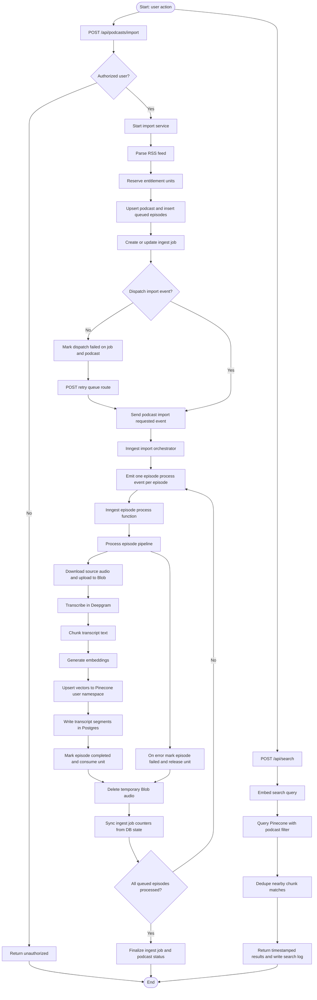

# How Imago Podcasting Works

This document explains the runtime flow of the app, with emphasis on backend events, processing, and data movement.

## 1) High-level architecture

Imago is a Next.js app that lets authenticated users:
- import podcast episodes from RSS,
- process episodes in a background workflow (transcription + chunking + embeddings),
- run semantic search over transcript chunks,
- export transcripts.

Core backend building blocks:
- API layer: Next.js App Router routes under `src/app/api/**`
- Auth: Clerk (`requireUser`)
- Database: Neon Postgres via Drizzle
- Workflow/events: Inngest (`podcast/import.requested`)
- Transcription: Deepgram
- Vectorization: Vercel AI Gateway embeddings
- Vector store: Pinecone (namespace per user)
- Temporary audio storage: Vercel Blob

## 2) Main flow diagram (Mermaid)

## 3) Ingestion and event lifecycle

1. Client starts import with `POST /api/podcasts/import`.
2. Backend parses RSS, filters already-known GUIDs, and reserves episode units from entitlement capacity.
3. Backend inserts `episodes` (status `queued`) and an `ingest_jobs` record.
4. Backend dispatches Inngest event `podcast/import.requested`.
5. Orchestrator function fans out one `podcast/episode.process.requested` event per episode.
6. Episode worker processes each episode independently and syncs job counters from episode statuses.
7. Job/podcast status is finalized:
- success path: `ingest_jobs.status = completed`, `podcasts.status = ready`
- partial failure path: `ingest_jobs.status = completed_with_errors`, `podcasts.status = ready_with_errors`
- dispatch failure path: `queueDispatchStatus = failed`, `podcasts.status = dispatch_failed`

Retry behavior:
- `POST /api/podcasts/:podcastId/retry-queue` re-sends the same job’s queued episode IDs if dispatch previously failed/pending.

## 4) Episode processing internals

Per episode, the pipeline does:
1. Mark episode `processing`.
2. Download source audio and upload to Blob.
3. Call Deepgram URL transcription endpoint with diarization and utterances enabled.
4. Merge utterances into overlapping chunks (`chunkUtterances`).
5. Generate embeddings for chunk text.
6. Upsert vectors into Pinecone with metadata (`episodeId`, timestamps, speaker, snippet, etc.).
7. Replace transcript rows in `transcript_segments`.
8. Mark episode `completed` and consume reserved usage unit.
9. Always delete temporary Blob audio and clear `audioBlobUrl`.

Failure behavior:
- Episode marked `failed` with `errorMessage`.
- Reserved usage unit is released.

## 5) Search flow

1. Client calls `POST /api/search` with `podcastId`, query, and `topK`.
2. Server verifies podcast ownership for the current Clerk user.
3. Query text is embedded.
4. Pinecone is queried in the user namespace, filtered by `podcastId`.
5. Results are deduped by episode and near-identical time windows.
6. API returns timestamped episode URLs and logs query stats in `search_logs`.

## 6) Core data model

Primary tables:
- `podcasts`: feed metadata + overall processing state.
- `ingest_jobs`: import job state, counters, queue dispatch status/errors.
- `episodes`: per-episode status and failures.
- `transcript_segments`: chunk-level transcript records linked to vectors.
- `usage_ledger`: entitlement reservations/consumption/release.
- `account_entitlements` and `plans`: quota and credit configuration.
- `search_logs`: query analytics (count + latency).

Status fields drive UI progress:
- episode status: `queued`, `processing`, `completed`, `failed`
- job status: `queued`, `processing`, `completed`, `completed_with_errors`, `dispatch_failed`
- podcast status: `idle`, `queued`, `processing`, `dispatch_failed`, `ready`, `ready_with_errors`

## 7) API surface (backend-relevant)

Import and processing:
- `POST /api/podcasts/import`
- `POST /api/podcasts/:podcastId/resync`
- `POST /api/podcasts/:podcastId/retry-queue`
- `POST /api/inngest` (Inngest webhook execution)

Read/status:
- `GET /api/podcasts`
- `GET /api/podcasts/:podcastId/episodes`
- `GET /api/podcasts/:podcastId/status`

Search:
- `POST /api/search`

Entitlements/admin:
- `GET /api/account/entitlements`
- `POST /api/admin/entitlements/adjust`

Exports:
- `GET /api/podcasts/:podcastId/transcripts/download`
- `GET /api/podcasts/:podcastId/episodes/:episodeId/transcript/download`

## 8) Operational notes

- `/api/inngest` is intentionally public in middleware so Inngest can call it; most other app routes require Clerk auth.
- Episode quota is enforced before queue dispatch via entitlement reservation policy plus `ABSOLUTE_EPISODE_SAFETY_CAP`.
- Queue dispatch can fail independently of API success; dashboard supports manual retry to recover.
